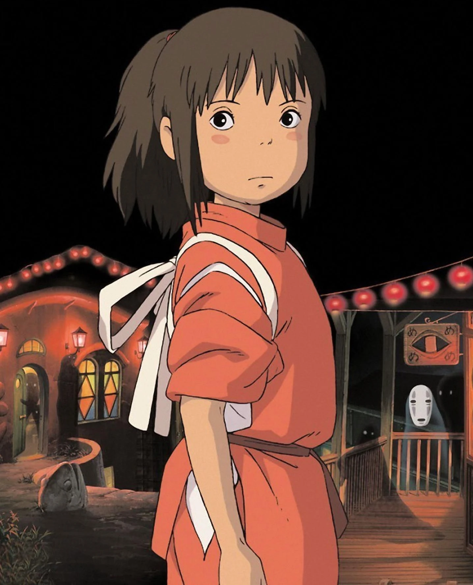
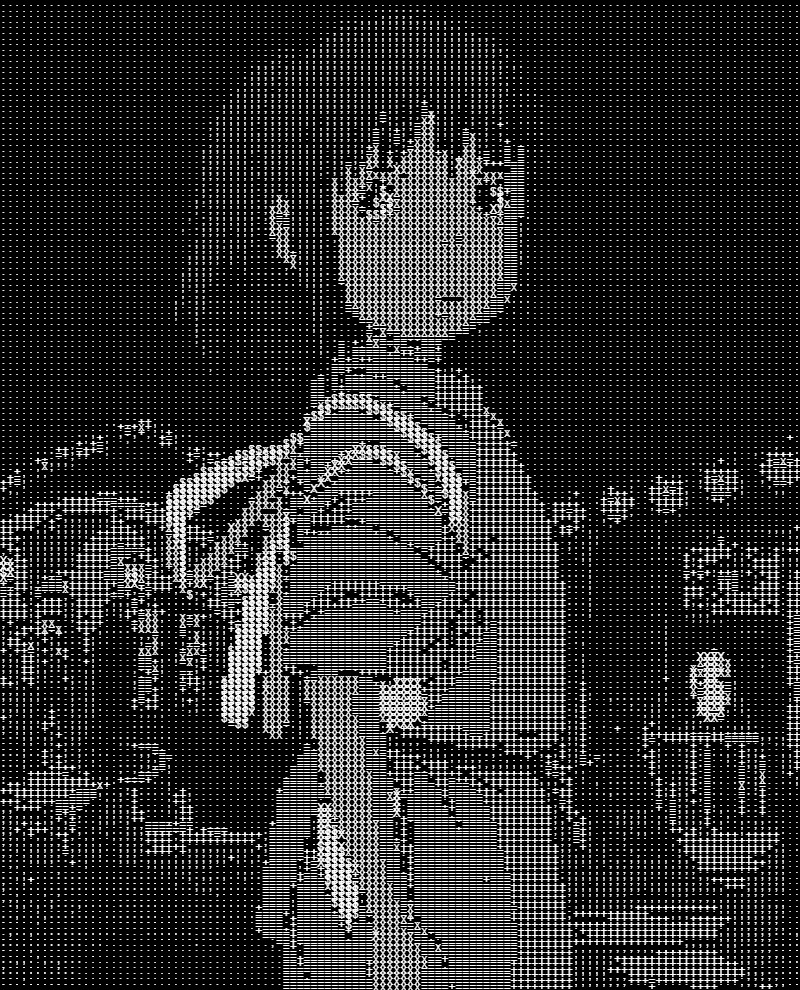
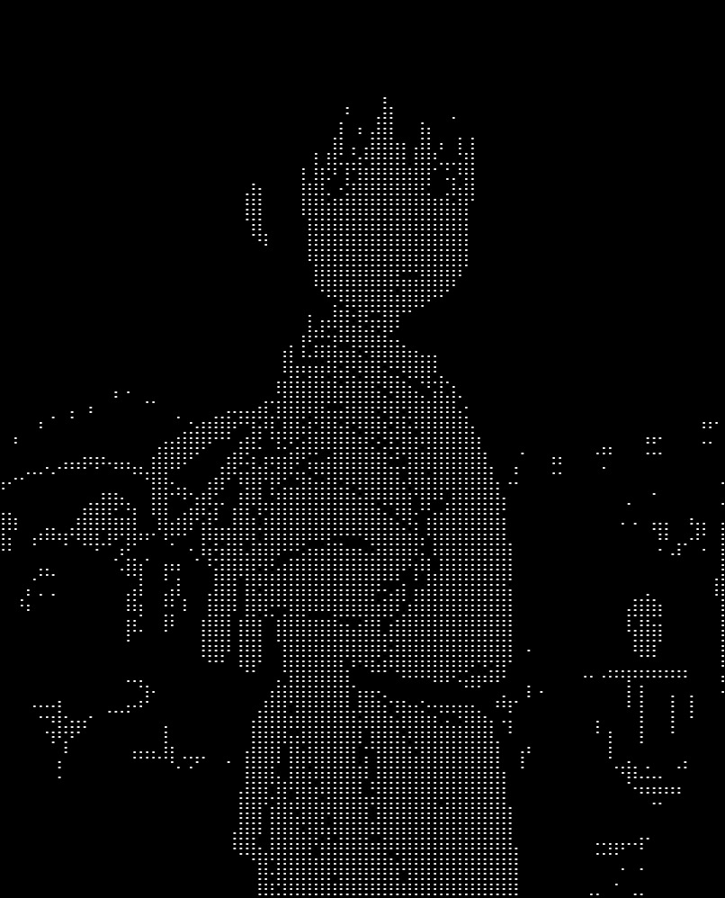
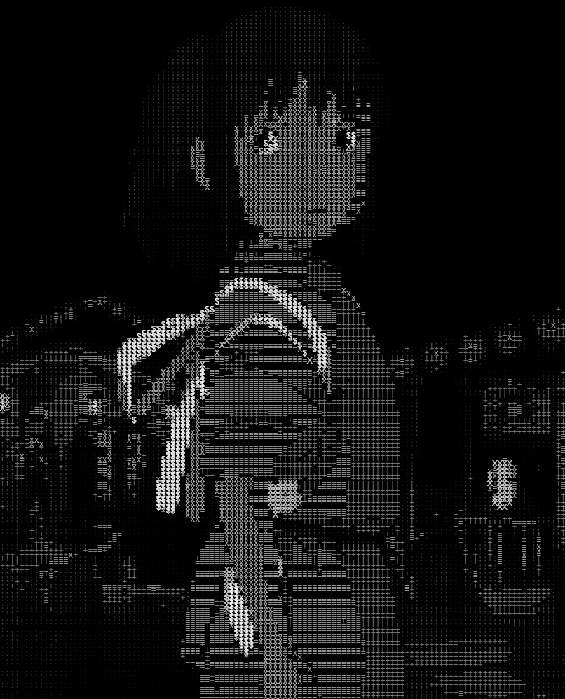
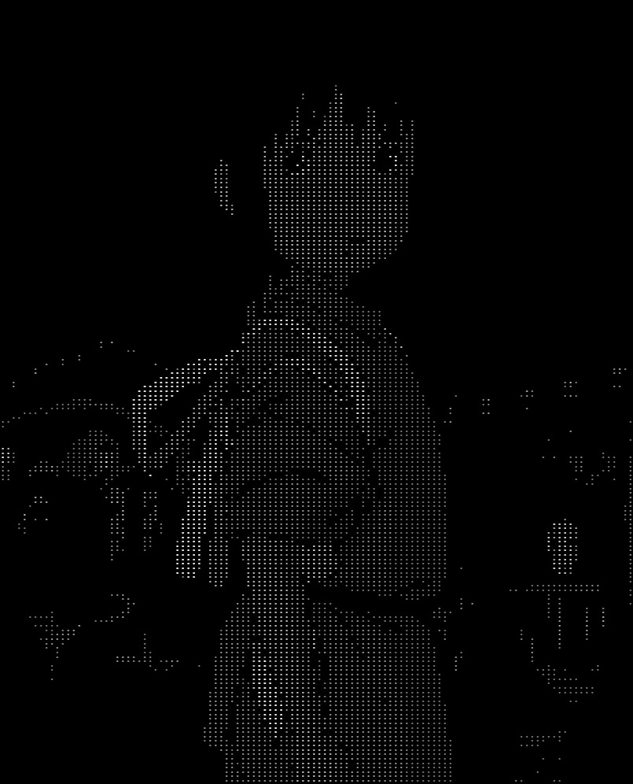
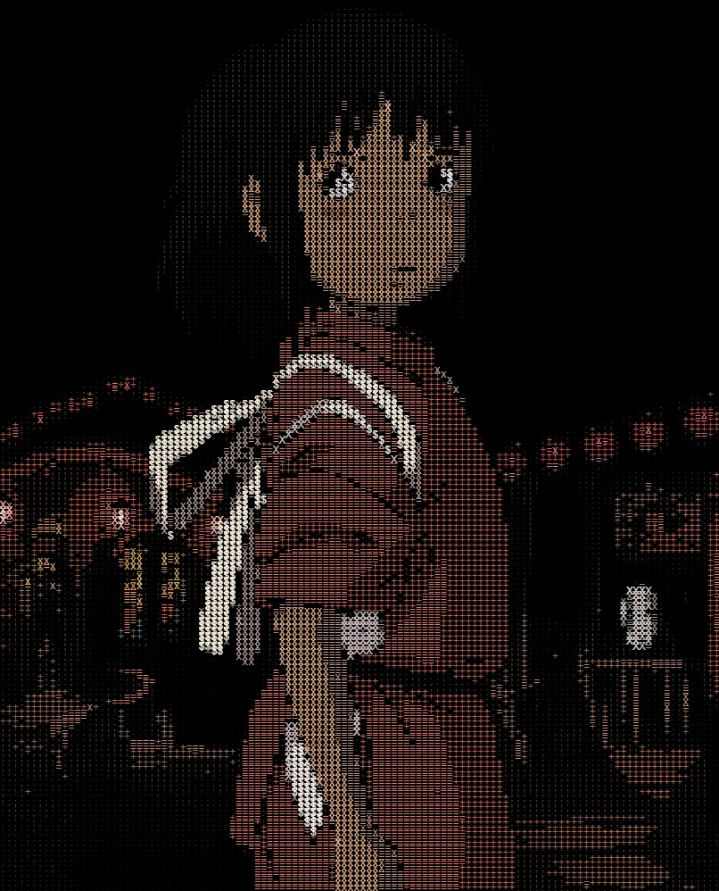
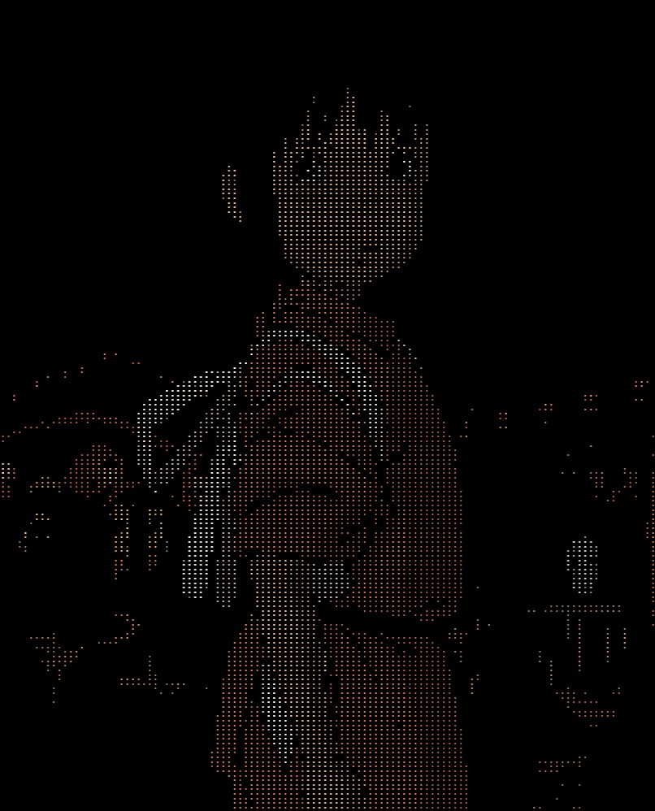

# Ascii Converter

A simple js script to convert images into Ascii/Dot art based on the perceived brightness of each pixel.
(I might add more features in the future)

## Usage

Just download the repo, unzip it, double click the html file and you're good to go.

## Examples

The following images are converted using the script with different options.

(Not the actual Ascii/Dot art copied as text)

**With Shading:**

**With Colors:**

## References

- [p5.js](https://p5js.org/reference/)
- [Brightness Formula](https://stackoverflow.com/a/56678483)
